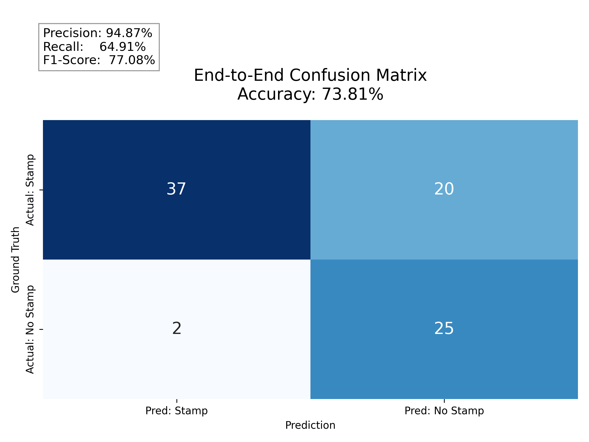

# Passport Stamp Extraction Demo

## Project Structure
```
passport_stamp/
├── .env                  
├── .env.example          # Template for .env
├── app.py                # Streamlit demo
├── settings/
│   ├── __init__.py
│   └── config.py         # Environment loader
├── models/
│   ├── __init__.py
│   ├── detector.py       # YOLO
│   └── extractor.py      # Azure Document Intelligence
├── utils/
│   ├── __init__.py
│   └── post_process.py   # Date parsing logic
├── others/               # Other script no related to pipeline and demo
│   ├── eval.py           # E2E evaluation
│   └── gen_report.py     # Generate confusion matrix 
└── pipeline.py           # The Orchestrator
```

> Note: `app.py` and `post-process` are fully vibe coded 

## End-to-end result on Test set

Definitions: TP, TN, FP, FN on E2E

- True Positive (TP):
    The system correctly identified a stamp that exists on the document and successfully extracted the date. It is the "exact match."

- True Negative (TN):
    The system correctly identified that no stamp exists on a document page (or a specific region) and returned no data.

- False Positive (FP):
    The system reported a stamp date, but it was incorrect. This could be due to an OCR error. This is a critical error because the extracted date was wrong.

- False Negative (FN):
    A stamp exists on the document, but the system failed to extract any date. This is missing. It requires a human to manually complete the data entry.

<p align="center">
  
  <br>
  <em>Figure 1: E2E Confusion Matrix</em>
</p>

## Setup

```bash
pip install streamlit opencv-python-headless pillow pandas
streamlit run demo_app.py
```

## Pipeline Integration

In `demo_app.py`, find the comment block and replace with your real call:

```python
# from pipeline import DocumentPipeline
# pipeline = DocumentPipeline()
stamps = pipeline.process(img_np)
```

## Expected `stamps` Schema

`pipeline.process()` must return a list of dicts in this format:

```python
[
    {
        "id":       "STAMP-01",          # unique string per stamp
        "type":     "Entry",             # "Entry" | "Exit"
        "box":      [x1, y1, x2, y2],   # pixel coords on original image
        "det_conf": 0.95,                # YOLO detection confidence (0-1)
        "dates": [
            {
                "value":    "12 MAR 2026",  # string, format: DD MMM YYYY
                "type":     "Entry",        # "Entry" | "Until"
                "ocr_conf": 0.98            # Azure OCR confidence (0-1)
            },
            {
                "value":    "10 APR 2026",
                "type":     "Until",
                "ocr_conf": 0.55
            }
        ]
    },
    {
        "id":       "STAMP-02",
        "type":     "Exit",
        "box":      [300, 250, 600, 400],
        "det_conf": 0.88,
        "dates": [
            {
                "value":    "15 MAR 2026",
                "type":     "Exit",
                "ocr_conf": 0.92
            }
        ]
    }
]
```

## Mock for Local Testing

Paste this directly into `demo_app.py` during development
(replace the `stamps = []` line):

```python
import time
time.sleep(0.8)
stamps = [
    {
        "id": "STAMP-01", "type": "Entry",
        "box": [50, 50, 350, 200], "det_conf": 0.95,
        "dates": [
            {"value": "12 MAR 2026", "type": "Entry", "ocr_conf": 0.98},
            {"value": "10 APR 2026", "type": "Until", "ocr_conf": 0.55},
        ],
    },
    {
        "id": "STAMP-02", "type": "Exit",
        "box": [300, 250, 600, 400], "det_conf": 0.88,
        "dates": [
            {"value": "15 MAR 2026", "type": "Exit", "ocr_conf": 0.92},
        ],
    },
]
```

## Colour Reference

| Token    | Hex       | Usage                     |
|----------|-----------|---------------------------|
| Entry    | `#4C4794` | Digital Purple            |
| Exit     | `#D31145` | Digital Red 500           |
| Until    | `#FF7A85` | Digital Salmon            |
| Text     | `#333D47` | Digital Charcoal 600      |
| BG cards | `#F4F4F4` | Charcoal 100              |